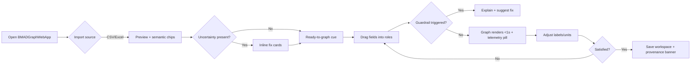
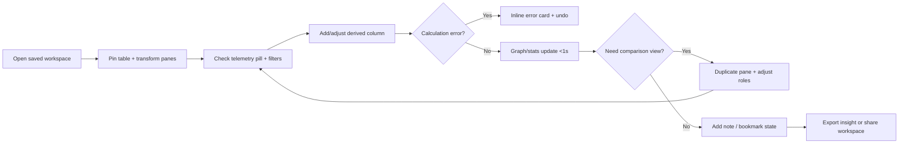
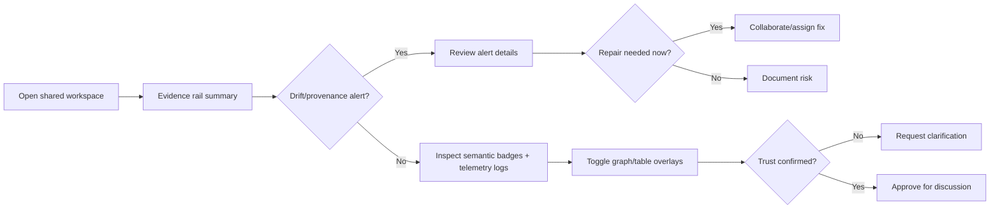

---
stepsCompleted:
  - step-01-init.md
  - step-02-discovery.md
  - step-03-core-experience.md
  - step-04-emotional-response.md
  - step-05-inspiration.md
  - step-06-design-system.md
  - step-07-defining-experience.md
  - step-08-visual-foundation.md
  - step-09-design-directions.md
  - step-10-user-journeys.md
  - step-11-component-strategy.md
  - step-12-ux-patterns.md
  - step-13-responsive-accessibility.md
  - step-14-complete.md
inputDocuments:
  - /home/pin81845/repo/BMADGraphWebApp/_bmad-output/planning-artifacts/prd.md
  - /home/pin81845/repo/BMADGraphWebApp/_bmad-output/planning-artifacts/prd-validation-report-2026-04-06.md
  - /home/pin81845/repo/BMADGraphWebApp/_bmad-output/planning-artifacts/product-brief-BMADGraphWebApp-2026-03-24.md
  - /home/pin81845/repo/BMADGraphWebApp/docs/essential-graphing.pdf
  - /home/pin81845/repo/BMADGraphWebApp/docs/essential-graphing.parsed.txt
---

# UX Design Specification BMADGraphWebApp

**Author:** Pinto
**Date:** 2026-04-06

---

<!-- UX design content will be appended sequentially through collaborative workflow steps -->
## Executive Summary

### Project Vision
BMADGraphWebApp must prove that a browser-native analytical loop—import → semantic correction → lightweight prep → graphing → stats → reproducible workspace—can be completed independently in ≤10 minutes while staying responsive (≤1 s edits) and WCAG-compliant. UX therefore has to choreograph a single, trustworthy surface that feels calm for first-timers and powerful for investigators without fragmenting state.

### Target Users
- **David Mercer (non-technical domain engineer):** Feels anxious about “breaking the data.” Needs a guided runway with semantic badges, inline fix cards, and celebratory confirmations so his first report-ready graph feels inevitable, not fragile, and the default view must stay calm even while advanced options exist.
- **Priya Raman (technical R&D engineer):** Lives in investigative flow. Needs simultaneous views of table, transforms, and graph facets with frictionless variable remaps, derived-column context, and workspace snapshots she can resume without rebuilding, all while preserving the ≤1 s responsiveness promise.
- **Elena Brooks (quality reviewer):** Trust hinges on provenance. Needs readable audit trails—units, transformations, warnings—layered on graphs/tables plus clear signals when reopened workspaces drift from the saved state, so reviewer sign-off never depends on guesswork.

### Key Design Challenges
1. **Import & semantic steering without drag:** Surface uncertainties (delimiter, role, unit) inline, offer one-click repairs, and keep David moving while giving Priya fast overrides that still honor FR1–FR26 and NFR1.
2. **Graph construction that scales in clarity:** Give users direct-manipulation builders, layer controls, and presentation edits (FR27–FR34, FR36–FR37) while keeping layouts legible on narrow workstations.
3. **Guardrails for complex compositions:** Enforce limits, explain blocked combinations, and keep overlays honest so Priya’s multi-variable analyses never violate FR35/FR38 or the performance gates in NFR2–NFR5.
4. **Persistent trust fabric:** Expose transformations, formulas, semantic overrides, and reopen warnings as first-class artifacts so Elena can audit FR43–FR59 scenarios while NFR6–NFR10 guarantee saved-state fidelity, localized failures, unsaved-change protection, and transparent repair paths.
5. **Accessibility inside analytical depth:** Every control and inspector must remain keyboardable with visible focus states and textual analogs for visual meaning so WCAG 2.1 AA (NFR11–NFR14) is met even in dense views.

### Design Opportunities
1. **Confidence-first runway:** Starter layout with semantic chips, inline fixes, and progress cues that announce “ready to graph,” shrinking David’s anxiety while keeping measurement hooks for the ≤10-minute KPI.
2. **Composable investigation canvas:** Dockable panes that let Priya pin data, transforms, stats, and graphs together, with shared filters and undo/redo so exploration never drops context.
3. **Provenance overlays:** Toggleable “evidence layers” (units, filters, formula inputs, warnings) on any graph/table so Elena instantly sees why a visual can be trusted or what needs repair.
4. **Performance-aware micro-interactions:** Skeleton states, optimistic UI, and explicit “working on large dataset” banners that both reassure users and prove compliance with the performance/accessibility commitments.

## Core User Experience

### Defining Experience
The non-negotiable loop is “import with semantic guardrails → drop fields into role-aware zones with instant preview → annotate/present → save workspace.” David begins in a calm single-pane cockpit that shows import chips, role hints, and a big “ready to graph” call-to-action; Priya can tear off table, transform, stats, and graph panes into a multi-column layout without fragmenting the workspace state. Every drag-to-plot resolves in ≤1 s, carries semantic badges forward, and displays lightweight telemetry (“Rendered in 0.8 s”) so reviewers and PMs see performance evidence.

### Platform Strategy
- Desktop-class web app targeting Chrome/Edge (primary) and Firefox (stretch) with mouse+keyboard as first-class input; touch gestures are supportive but optional.
- Centrally hosted shell (Next.js bundle + service worker) loads through the browser, precaches itself for offline use within 5 s, and announces “Ready for offline use” once caching completes.
- One workspace kernel drives tables, graphs, stats, and provenance overlays so save/reopen feels like pausing a session; reopening restores pane layout, filters, and warnings automatically.
- Import, drag latency, and reopen timing are instrumented and surfaced in-context (status toasts, timeline chips) so KPI compliance stays visible to users and the team; telemetry queues locally when offline and flushes automatically when connectivity returns.
- Local-first file handling per PRD; datasets, transformations, and workspaces stay on the user’s machine and the shell only surfaces update prompts/environment checks without uploading user content.

### Effortless Interactions
- Import preview behaves like a semantic command palette: delimiter guesses, units, and roles appear as editable chips; fixes feel like tagging rather than modal data entry, and keyboard shortcuts hit every chip.
- Dropping a field into X/Y/color/facet instantly renders a publication-ready graph; hover previews highlight valid combinations, while blocked ones explain exactly what to change (“size requires numeric input: convert column or pick another field”).
- Semantic edits propagate everywhere—table headers, graph labels, stats summaries—without hunting through panels.
- Save/reopen resumes the prior layout, pinned panes, and provenance overlays automatically; if anything drifted or broke, warning banners guide reviewers to the repair card.

### Critical Success Moments
- First import fix followed by a “ready to graph” confirmation proves David can stay under the 10‑minute KPI.
- First drag-to-plot returns a trustable chart within a second, accompanied by telemetry and semantic badges, proving the ≤1 s responsiveness goal.
- Shell shows “Ready for offline use” once caching completes so users know they can keep working without a connection.
- Priya pins table and transform panes, edits a derived column, and watches graph + stats update with undo history intact.
- Elena opens a workspace and immediately toggles evidence overlays while drift indicators point to any transformations needing repair.

### Experience Principles
1. **One state, many views:** Table, graph, stats, and overlays are synchronized reflections of the same workspace kernel.
2. **Confidence-first onboarding:** Semantic chips, hover hints, and celebratory confirmations make early actions feel inevitable rather than fragile.
3. **Performance is visible UX:** Spinners, skeletons, and duration badges reassure users that latency targets (≤1 s edits, ≤10 s reopen) are being met.
4. **Explain every guardrail:** Previews highlight safe configurations, and any warning includes the root cause plus a one-click fix path.

## Desired Emotional Response

### Primary Emotional Goals
- **Confident independence:** David and other non-technical engineers should feel capable, calm, and unblocked from the moment they import data through their first report-ready graph.
- **Investigative momentum:** Priya should feel energized and in flow, sensing that the workspace keeps up with her curiosity rather than slowing it down.
- **Reviewer trust:** Elena should feel assured that every visual is transparent, auditable, and defensible before it enters a quality discussion.

### Emotional Journey Mapping
- **First discovery / onboarding:** Tone is calm and invitational—semantic chips, helper text, and performance assurances reduce anxiety about “breaking the data.”
- **Core loop (import → graph):** Users feel supported yet in control; guardrails explain decisions so confidence grows with every drag-to-plot.
- **Completion:** Saving or exporting delivers a small celebration plus provenance cues so users feel proud of credible output.
- **Error or drift:** When something misbehaves, messaging feels like a helpful teammate—“here’s what failed, here’s how to fix it”—preventing panic.
- **Return visits:** Opening a workspace should feel like meeting an organized colleague who remembers everything, reinforcing long-term trust.

### Micro-Emotions
- **Moments of confidence** (import chips, “ready to graph” badge) vs. **eliminated confusion** (guardrail explanations).
- **Curiosity → delight** when hover previews show valid variable combos.
- **Accomplishment** when telemetry confirms graphs rendered fast and saved state is clean.
- **Relief** when drift warnings pinpoint issues without forcing rework of good work.

### Design Implications
- **Confidence → Guided cues:** Use semantic badges, inline fix cards, and celebratory confirmations so early interactions never feel risky.
- **Momentum → Responsive feedback:** Keep drag-to-plot, derived-column edits, and pane pinning under the performance targets, with visible telemetry to prove it.
- **Trust → Transparent overlays:** Provenance layers, warning banners, and evidence cards show reviewers exactly what changed and why.
- **Calm recovery → Repair cards:** When errors occur, provide localized fix panels with human-readable explanations rather than generic modals.

### Emotional Design Principles
1. **Reassure before you challenge:** Every new action starts with context and guidance so users lean in rather than freeze.
2. **Make flow visible:** Show timing, provenance, and undo trails so momentum feels tangible.
3. **Narrate the safety net:** Guardrails and warnings always explain root cause plus recovery, turning setbacks into teachable moments.
4. **Celebrate credible outcomes:** Finishing a graph or reopening a workspace surfaces subtle cues (“analysis intact,” “export ready”) to reinforce pride and trust.

## UX Pattern Analysis & Inspiration

### Inspiring Products Analysis
- **JMP Graph Builder:** Proves dense analytical controls can stay approachable via drag targets, semantic badges, and layered previews. Error messaging is inline, not modal, helping David recover quickly.
- **Observable Plot / Mode Notebooks:** Multi-pane workspaces let Priya pin tables, charts, and code together, mirroring our “one state, many views” principle. Saving a notebook feels like pausing a conversation—exactly the reopen experience we want.
- **Figma (for state continuity) & Notion databases (for inline editing cues):** Figma’s multiplayer state model inspires our canonical workspace approach, while Notion’s inline property chips demonstrate how semantic corrections can feel lightweight and calm.

### Transferable UX Patterns
- **Navigation/Layout:** Collapsible sidebars and pin-able panes from Observable/Figma support both David’s single-pane calm mode and Priya’s investigative layout.
- **Interaction:** JMP’s role-aware drop zones and Notion’s inline chips show how semantic corrections and drag-to-plot can share the same visual language.
- **Visual:** Subtle telemetry badges (Observable’s run-time stamps) and trust indicators (Notion’s “synced/unsynced” states) map directly to our confidence and performance goals.

### Anti-Patterns to Avoid
- **Excel-esque hidden modes:** Mode switches that alter data without clear cues lead to mistrust; we must keep semantic state visible.
- **Overloaded toolbar jungles:** Wide icon belts (common in legacy analytics suites) overwhelm David; controls should appear contextually.
- **Silent failures on reopen:** Some notebook tools drop cells without notice; our reopen must warn reviewers immediately when a formula or dataset drifts.

### Design Inspiration Strategy
- **Adopt:** Role-aware drag targets and inline semantic chips to blend import correction with graph building, reinforcing confident independence.
- **Adapt:** Observable’s multi-pane workspaces—make panes dock/undock but keep David’s default view calm and guided.
- **Avoid:** Hidden state toggles or destructive edits without provenance messaging—they conflict with Elena’s trust requirements.

## Design System Foundation

### 1.1 Design System Choice
Use a themeable MUI foundation layered with custom “workspace primitives” (semantic chips, role-aware drop zones, telemetry badges, provenance overlays) so we get proven accessibility and layout primitives while preserving BMADGraphWebApp’s analytical personality.

### Rationale for Selection
- **Delivery speed with credibility:** MUI’s mature React components (tables, drawers, dialogs, focus management) let us meet the desktop MVP timeline without rewriting basics.
- **Extension path for analytical primitives (Risk 2 mitigation):** By explicitly defining workspace primitives on top of MUI—and documenting them in Storybook—we keep the bespoke graphing affordances coherent instead of scattering custom code through the app.
- **State-coherent layout kit (Risk 3 mitigation):** Standardizing on MUI Grid + Drawer + a sanctioned Resizable Panels utility prevents teams from introducing rogue layout libraries that would fracture the canonical workspace.
- **Lightweight telemetry instrumentation (Risk 4 mitigation):** Building telemetry badges as shared hooks layered on existing components ensures performance instrumentation doesn’t re-render entire panels, so we highlight latency compliance without hurting responsiveness.

### Implementation Approach
1. **Token + theme layer:** Define base colors/typography/spacing within MUI’s theming API, then expose “Calm Graphing” and “Investigative Focus” variants that share tokens but tweak density.
2. **Workspace primitives:** Build semantic chip editor, role-aware drop zones, telemetry badges, and provenance banners as first-class components (with specs, props, and usage stories) so engineers know they’re reusable building blocks.
3. **Official layout kit:** Publish approved combinations of Grid, Drawer, and Resizable Panels for calm single-pane mode and Priya’s tear-off layout; forbid other layout utilities to keep state synchronized.
4. **Telemetry hook:** Create a shared hook/service that feeds badges and banners; components subscribe for lightweight updates instead of embedding bespoke timers.

### Customization Strategy
- **Visual voice:** Start with calm neutrals, confident accent colors, and high-contrast warning states; expose density tokens so investigative panes tighten spacing without altering components.
- **Documentation & governance:** Maintain a design-system workspace (Storybook + usage guidelines) covering emotional intent, performance budgets, and extension rules to keep custom primitives aligned with the product’s goals.
- **Rollout plan:** Pilot the foundation on import preview and graph builder surfaces first, validate telemetry overlays don’t regress latency, then roll across the rest of the workspace.

## Visual Design Foundation

### Color System
- **Core palette:** Soft graphite (#1F1F24) for primary text, slate blue (#2C3F5F) for structural elements, light mist (#F3F5F8) for backgrounds, and a confident teal accent (#1CA7A7) signaling active graph states. Warning tones use ember orange (#D97706) and errors use crimson (#B42318).
- **Semantic mapping:**  
  - Primary: Slate blue for navigation, titles, workspace chrome.  
  - Secondary: Teal accent for active drag zones, telemetry pills, confirmations.  
  - Success: Emerald (#1E8556) for “analysis intact” moments.  
  - Warning/Error: Ember/Crimson with dark text for drift alerts and guardrails.
- **Accessibility:** Text/background pairs meet WCAG 2.1 AA; tokens include paired light/dark variants so telemetry pills stay legible atop graphs. Automated contrast checks run whenever tokens change.

### Typography System
- **Typeface pairing:** Inter (sans serif) for UI and analytical labels, paired with IBM Plex Mono for inline code/telemetry readings.
- **Hierarchy:** H1 28/36, H2 22/30, H3 18/26, Body 14/22, Mini 12/18. Tight letter-spacing on metrics to evoke precision, wider tracking on helper text for calm onboarding.
- **Tone:** Modern, confident, highly legible at dense data scales.

### Spacing & Layout Foundation
- **Base unit:** 8px grid (aligned with MUI); investigative panes may use 4px micro spacing while staying aligned to 8px multiples.
- **Layout principles:** Calm outer shell (24px padding), dense core (8px gutters), 12-column grid with inspectors occupying four columns, main graph/table spanning eight.
- **Responsive docking:** Pin-able panes snap to grid breakpoints; component padding uses 8px internal spacing, chip stacks follow 4px rhythm.

### Accessibility Considerations
- Minimum 44x44px hit areas for drag handles and toolbar actions.
- High-contrast teal focus rings visible on dense tables.
- Dark-mode-ready token variants maintain ≥4.5:1 contrast.
- Typography scale ensures body text ≥14px with 22px line height for readability on 13” laptops.

## Core Interaction Blueprint

### Defining Experience
“Drag data into meaning and trust it instantly.” The hero moment is when a user drops fields into role-aware zones, sees a publication-grade graph render in under a second, and feels certain every semantic choice, transform, and telemetry badge is accurate. David experiences this in a calm single-pane cockpit, while Priya can tear off table/transform panes without leaving the canonical workspace.

### User Mental Model
- **Current behavior:** Users bounce between Excel (familiar but weak) and JMP (powerful but overwhelming). Their expectation is “drag fields, tweak settings, trust the result.”
- **Pain points:** Hidden state, modal error loops, and start-from-scratch reopen flows. They want semantic fixes to feel like editing labels, not reimporting data.
- **Mental shorthand:** “I pick columns, the graph appears, and I can reuse it later.” Our UX must mirror that muscle memory with inline chips, role previews, and safe undo.

### Success Criteria
1. **Time-to-first-graph ≤ 10 minutes:** Import → semantic fix → drag-to-plot completes inside the KPI even on messy data.
2. **Responsive graphing:** Drag, facet, or derived-column edits redraw within ≤1 s and display telemetry badges (“Rendered in 0.7 s”).
3. **Trustful reopen:** Saved workspaces revive the same layout, provenance overlays, and warnings; reviewers see issues before presenting.

### Novel vs. Established Patterns
- **Established elements:** Drag-to-plot, inline chips, collapsible inspectors—all familiar from JMP/Notion/Observable.
- **Novel twist:** Pre-drop role previews, telemetry badges, and provenance overlays tightly integrated so analytical trust is visible at every step.
- **Education strategy:** Use hover hints, semantic badges, and onboarding tours that mirror users’ existing mental models (“drag X here, color there”) while subtly introducing telemetry and evidence layers.

### Experience Mechanics
1. **Initiation:** Guided import preview surfaces semantic chips with keyboard shortcuts; “Ready to graph” cue invites the first drag.
2. **Interaction:** Users drag fields into highlighted zones; hover previews show valid roles, invalid combos display guardrails (“Size needs numeric input”); Priya can pin panes mid-flow.
3. **Feedback:** Graph renders in ≤1 s with semantic badges and telemetry pill; inline hints confirm transforms propagated; guardrails explain fixes.
4. **Completion:** Users save/export; provenance overlays confirm integrity, and a success toast (“Analysis intact, saved 14:32”) reinforces pride. Reopen resumes the same layout with drift warnings if needed.

## Design Direction Decision

### Design Directions Explored
- **Calm Cockpit:** Wide single-pane, large semantic chips, low-contrast chrome.
- **Investigator Dock:** Dense, pin-able panes with telemetry pylons surfaced prominently.
- **Trust Overlay Focus:** Provenance banners and drift cards foregrounded.
- **Hybrid Workspace:** Calm default that can expand into a resizable dock without duplicating products.

### Chosen Direction
**Hybrid Workspace with guarded mode switching** — David starts in the Calm Cockpit; Priya can tap “Expand Workspace” to reveal the docked layout. The telemetry/evidence rail stays visible in both modes so Elena always sees trust cues.

### Design Rationale
- Covers the 10-minute KPI and investigative flow without diverging design languages.
- Keeps telemetry and provenance components invariant, reinforcing trust.
- Aligns with the MUI-based layout kit, reducing implementation risk.

### Failure Modes & Mitigations
1. **Mode confusion:** Persistent “Workspace Mode” toggle with hover copy (“Calm cockpit” / “Investigative dock”) plus a subtle frame accent when the dock is active.
2. **Hidden trust signals:** Evidence rail and telemetry pills never disappear; mode switching only repositions panes, preventing state drift.
3. **Performance load:** Layout switches are instrumented; if a configuration pushes past the ≤1 s budget, a non-blocking “Heavy layout—consider collapsing panes” notice appears.

### Implementation Approach
1. Ship Calm Cockpit first with semantic chips and telemetry visible.
2. Implement the sanctioned layout kit for docking; require the explicit “Expand Workspace” action to enter investigative mode.
3. Keep the evidence rail pinned to the right in both modes and source telemetry pills from the shared hook.
4. Document both states and the mode-toggle contract in Storybook so teams maintain consistency.

## User Journey Flows

### David – First Report-Ready Graph (<10 mins)

David starts with a local CSV and wants a graph without feeling overwhelmed.

### Priya – Investigative Dock Workflow

Priya needs simultaneous views, quick derived columns, and telemetry proof.

### Elena – Reviewer Trust Flow

Elena opens a shared workspace to validate before a quality meeting.

### Journey Patterns
- **Navigation:** Calm cockpit with explicit “Expand Workspace” toggle and a persistent evidence rail.
- **Decision:** Repeatable “Is this trustworthy?” checks leveraging guardrails and telemetry pills.
- **Feedback:** Success toasts (“Analysis intact”), inline guardrail copy, and telemetry badges as constant reassurance.

### Flow Optimization Principles
1. **Progress cues:** “Ready to graph” badges, telemetry pills, and evidence rail statuses indicate users are on track.
2. **Localized recovery:** Inline error cards, undo per action, and guardrail copy prevent cascading frustration.
3. **Mode intentionality:** Calm Cockpit is default; Investigative Dock requires an explicit toggle with breadcrumbs back.

## Component Strategy

### Design System Components
- **MUI Foundations in Play:** AppBar, Drawer, Tabs, DataGrid, Dialog, Snackbar, Tooltip, Menus, Buttons/IconButtons, Checkbox/Radio, Slider, TextField, Stepper. Each baseline widget is wrapped with BMAD tokens (Calm vs. Investigative density) and audited via axe-core scripts plus focus-order snapshot tests so KPI telemetry doesn’t come at the cost of usability.
- **Layout & Focus Kit:** Grid, Stack, Divider, Card, Chip, Badge, Paper, and the sanctioned Resizable Panels utility form the workspace shell. Docked regions register `role="region"` with focus sentinels, and every pane publishes a `data-workspace-pane` attribute so QA can automate Calm ↔ Dock regression sweeps.

### Custom Components
1. **Semantic Chip Editor**
   - **Purpose:** Inline semantic fixes with provenance badges that keep David calm and Priya fast.
   - **Content & Actions:** Displays detected type, unit, role, and confidence; keyboard cycling (`Tab`/`Shift+Tab`) plus quick confirm (⌘+Enter). Suspense boundaries keep import preview responsive while metadata streams in.
   - **States:** default, uncertain, conflict, locked-by-reviewer; uncertainty resolutions fire ARIA live announcements.
   - **Testing Hooks:** `data-chip-id` attributes let QA snapshot diffs across massive datasets.
2. **Role-Aware Drop Zone**
   - **Purpose:** Builder targets that preview valid column roles before drop.
   - **Content & Actions:** Hover tooltips list compatible fields, guardrails describe violations, inline “fix” links jump to the chip editor.
   - **States:** idle, preview, accepted, blocked, loading; blocked messages quantify KPI impact (“Adds 0.3 s render cost—convert to numeric first”).
3. **Telemetry Badge**
   - **Purpose:** Attach render duration and data freshness to every chart/table.
   - **Content:** `render_time`, `rows_count`, freshness delta, warning flag.
   - **Actions:** Click reveals latency trace; long-press copies debug bundle.
   - **States:** on-budget, near-budget, breach, offline cache. Breach events automatically log to the evidence rail, and offline mode shows “stale” tooltips.
4. **Evidence Rail / Reviewer Log**
   - **Purpose:** Persistent provenance + drift log so Elena trusts every view.
   - **Content:** Chronological cards (imports, transforms, approvals, alerts) with persona + severity filters that persist per workspace and expose a REST hook for QA replay.
   - **Actions:** Assign repair, add reviewer note, pin card; collapses to icon rail with accessible badge counts.
   - **States:** clean, warning, blocking.
5. **Derived-Column Inspector**
   - **Purpose:** Formula editor with validation history and collision detection.
   - **Content:** Expression field, schema preview, impact radius, sample output.
   - **Actions:** Validate, version compare, revert, annotate the evidence rail.
   - **States:** draft, valid, error, deprecated; warns when collaborators edit the same column and offers merge guidance.
6. **Expand Workspace Toggle**
   - **Purpose:** Intentional Calm ↔ Investigative switch with KPI reminders.
   - **Content & Actions:** Mode labels, tooltip on trade-offs, layout presets on long press, keyboard shortcut `Ctrl+``; SR-only alerts announce every mode change and explain auto-collapse when perf guardrails trigger.
   - **States:** calm, investigative, limited.
7. **Drift Repair Card**
   - **Purpose:** Inline remediation for evidence-rail warnings.
   - **Content & Actions:** Shows failing asset, root cause, impact radius; lets users apply fix, snooze, or assign owner.
   - **States:** proposed, in-progress, resolved; telemetry pill flips green once KPI compliance returns, and elapsed time-to-fix is logged for QA.

### Shared Instrumentation & Resilience
- **`useWorkspaceSignal` Hook:** Streams telemetry/drift updates with optimistic UI, jitter/backoff, and sampling caps (≤2 renders/sec) so badges stay truthful without thrashing React trees.
- **Typed Contracts:** `WorkspaceSemantic`, `TelemetrySnapshot`, `DriftAlert`, `ReviewerAction` interfaces live in a shared package; CI contract tests fail fast when the workspace kernel changes.
- **Snapshot + Contract Tests:** Storybook “War Room” stories auto-generate Playwright snapshots for Calm and Dock layouts, preventing silent regressions; keyboard + hover equivalence tests keep drop zones trustworthy.
- **Progressive Resilience:** Components expose fallback props (skeleton drop zones, cached telemetry) so collaborative outages degrade gracefully instead of freezing the workspace.

### Component Implementation Strategy
- Pair every custom component with a War Room scenario (PM + Dev + UX acceptance notes, KPI budgets, accessibility proof) inside Storybook.
- Integrate Playwright + axe packs targeting docking transitions, evidence filters, and concurrency scenarios (e.g., two reviewers editing notes simultaneously).
- Add CI jobs that pump synthetic 100k-row datasets through drop zones and telemetry badges to verify latency budgets and reviewer logging stay intact.

### Implementation Roadmap
- **Phase 1 – Core Loop Stability:** Ship Semantic Chip Editor, Role-Aware Drop Zone, Telemetry Badge, Drift Repair Card alongside perf instrumentation gates (render budgets, lazy data hook tests) and offline fallbacks.
- **Phase 2 – Trust & Auditability:** Release Evidence Rail/Reviewer Log, Derived-Column Inspector, Expand Workspace Toggle with ARIA landmarks, reviewer-note persistence, and collision handling.
- **Phase 3 – Collaboration & Recovery:** Add bookmarkable investigative layouts, conditional approval badges, shared comments, multi-user drift merge, offline badge states, and auto-downgrade to Calm mode whenever KPI budgets fail; include resilience playbook tests (network drops, concurrent edits, telemetry outages).

## UX Consistency Patterns

### Button Hierarchy
**When to Use:** Any primary workspace action (import, “Ready to Graph”, “Apply repair”), secondary adjustments (facet toggles, evidence filters), quiet utilities (copy telemetry, pin panes), and reviewer approvals or rejections.  
**Visual Design:** Primary buttons use teal (#1CA7A7) fill with 4 px radius and bold 14 px Inter; secondary buttons use slate (#2C3F5F) outline; tertiary icon-buttons live inside panes with ghost backgrounds. Density adjusts with Calm vs. Investigative tokens but spacing (minimum 8 px gap) stays fixed.  
**Behavior:** Primary buttons trigger optimistic UI plus telemetry badge updates; disabled state shows tooltip explaining unmet preconditions. Secondary buttons queue reversible actions (undo stack). Loading states show inline spinner plus “Working…” label but must resolve under 1 s or surface progress text. Reviewer-action variant (teal outline with evidence context) always opens a confirmation card displaying provenance and requires a second confirmation.  
**Accessibility:** All buttons expose `aria-pressed` when toggleable, include screen-reader text for icon-only variants, and maintain 44 px minimum hit target. Focus ring uses teal outline with 2 px offset. Hover tooltips display keyboard shortcut hints and components set `aria-keyshortcuts` (for example `aria-keyshortcuts="Control+Enter"`).  
**Mobile Considerations:** Stack primary above secondary; collapse tertiary actions into a kebab menu while keeping telemetry inline.  
**Variants:** Calm (full-width primary), Investigative (compact cluster), destructive crimson variant, reviewer confirm (outlined) with evidence summary.

### Feedback Patterns
**When to Use:** Communicating telemetry, semantic validation, drift warnings, offline/online status, update availability, and success confirmations.  
**Visual Design:** Inline badges (success emerald, warning ember, error crimson, info slate) with icon plus label. Toasts appear top-right with subtle elevation matching the Calm palette; blocking alerts anchor in evidence-rail cards. Offline banners pin to the workspace top with neutral background and “Reconnect to send telemetry” messaging; telemetry backlog indicators reuse the pill style with a queue count.  
**Behavior:** Every interaction emits both an optimistic cue and real-time telemetry update. Success toasts auto-dismiss after four seconds; warnings persist until the user acknowledges or resolves the drift card. Errors always include “Retry” or “View details.” When telemetry breach and drift warning coincide, follow the escalation ladder: telemetry toast first, then an evidence-rail card with “Resolve Step 1 before Step 2” chips so reviewers know the order of operations. Offline mode auto-surfaces a banner plus a telemetry backlog pill; once connectivity returns, the banner clears, queued metrics flush, and an info toast confirms the catch-up. Update-available prompts appear as non-blocking toasts with a “Refresh shell” CTA and an optional modal when a critical fix lands.  
**Accessibility:** Toasts use `role="status"` (success/info) or `role="alert"` (warning/error). Color is never the sole signal—icons and text are required. Keyboard focus moves into blocking alerts automatically with Escape to dismiss. Offline banners expose `role="status"` with concise text (“Offline — analysis continues, telemetry will sync later”). Evidence-rail cards include screen-reader text describing resolution order and KPI impact, and update prompts announce keyboard shortcuts for refreshing the shell.  
**Mobile Considerations:** Toasts slide from bottom, occupying at most 40% of height; evidence-rail warnings collapse into a full-width sheet. Offline banners collapse into a chip above the bottom nav to preserve space yet remain discoverable.  
**Variants:** Passive telemetry pill, inline form helper, evidence-rail card, blocking modal for critical drift, offline banner, telemetry backlog indicator, update-available toast.

### Form Patterns
**When to Use:** Semantic chip edits, derived-column inspector, filter drawers, telemetry configuration.  
**Visual Design:** MUI TextField base with tokens for background (light mist) and focused border (teal). Group fields inside cards with 16 px padding; show helper text directly under inputs.  
**Behavior:** Real-time validation with inline messages; invalid states block submission but allow navigation. Undo history is exposed with “Revert” chips per field. Submission triggers an optimistic badge plus evidence-rail log. Bulk semantic correction mode allows multi-select chips with summary preview, and if apply exceeds 1 s a rollback chip appears. Collision alerts reference feedback patterns (“Priya editing this column—Take over / View changes”).  
**Accessibility:** Every input has an explicit label; error text uses `aria-live="assertive"`. Tab order follows top-to-bottom, left-to-right, and all custom editors provide keyboard shortcuts.  
**Mobile Considerations:** Collapse inspectors into accordions; show contextual keypad (numeric vs. text).  
**Variants:** Inline compact chip editor, full inspector panel, read-only provenance view, bulk-edit tray.

### Navigation Patterns
**When to Use:** Switching between Calm Cockpit, Investigative Dock, evidence-rail filters, pinned panes.  
**Visual Design:** Primary navigation is left dock (Calm) or top bar (Investigative) using slate background, 16 px icons plus labels; active state shows teal underline. The evidence-rail toggle sits persistently on the right with badge counts.  
**Behavior:** Mode toggle requires a confirmation tooltip describing trade-offs; switching preserves pane layout via bookmark tokens. Evidence-rail filters remember last selection per user. Keyboard shortcuts exist for every navigation action (`Ctrl+\`` toggles modes, `Shift+E` focuses evidence rail), and shortcut hints remain visible on hover or focus. “Trust View” preset opens Calm Cockpit with evidence rail expanded, filters preset to Elena’s role, and auto-focus on the first warning.  
**Accessibility:** Navigation landmarks (`role="navigation"` with `aria-label` per section); focus wraps logically and announces the current mode. Evidence-rail toggle announces badge counts (“Evidence rail focused, three warnings”).  
**Mobile Considerations:** Collapse navigation into a hamburger; evidence rail becomes a slide-over sheet still accessible via shortcut or button.  
**Variants:** Calm single-pane navigation, Investigative dock navigation, reviewer-focused Trust View preset.

### Additional Patterns

#### Modal and Overlay Patterns
**When to Use:** Drift repair cards, confirm destructive actions, reviewer notes.  
**Visual Design:** Use MUI Dialog with 24 px padding, focus trap, responsive max width (640 px desktop, 90% mobile).  
**Behavior:** Non-blocking overlays (repair cards) slide from the evidence rail; blocking dialogs dim the backdrop at 60% opacity and require explicit confirm/cancel. Telemetry and provenance information appear inline. Overlay depth policy: only one blocking modal may be open; side panels queue if another blocking overlay is active. Drift repair sliding over telemetry breach inherits the focus chain and posts a summary back when dismissed.  
**Accessibility:** `aria-modal="true"`, first focus on heading, Escape closes when non-critical. Provide a “Later” option to respect workflow.

#### Empty and Loading States
**When to Use:** No imports yet, empty evidence rail, loading graphs longer than 400 ms.  
**Visual Design:** Illustration-lite cards with action-oriented copy and direct CTA (“Import data to see semantic chips”). Skeleton loaders mimic the final layout to set expectations.  
**Behavior:** Loading states upgrade to progress text if exceeding 1 s; empty states surface tips plus link to docs. Reviewer-specific empty states offer a “Request provenance” button to ping the workspace owner.  
**Accessibility:** Skeletons include `aria-busy="true"`; empty-state copy lives in a live region so screen readers announce next steps.

#### Search and Filtering Patterns
**When to Use:** Column picker, evidence-rail log search, dataset filters.  
**Visual Design:** Search field with leading icon, clear button, and pill-based filters showing active facets.  
**Behavior:** Debounced (250 ms) updates maintain responsiveness; filters persist per workspace and can be saved as presets per role. Evidence-rail search results prepend severity badges and persona chips; screen-reader announcement states “Three warnings for Elena filters applied.” Applying a saved preset announces KPI impact (“Trust view filters set—telemetry unaffected”).  
**Accessibility:** `aria-expanded` on filter drawers, keyboard shortcuts for adding or removing pills, screen-reader text announcing result count changes.  
**Mobile Considerations:** Filters collapse into horizontal chips with a bottom sheet for advanced options.

#### Environment & Update Patterns
**When to Use:** Browser compatibility checks, storage permission issues, service worker refresh prompts, and offline-to-online transitions.  
**Visual Design:** Use compact cards pinned above the workspace with iconography for browser/storage states; update prompts reuse the toast pattern with a secondary “Learn what changed” link.  
**Behavior:** On load, the shell runs environment probes (supported browser, storage quota, filesystem access). Failing checks surface a persistent card explaining the issue plus one-click actions (“Enable storage access,” “Switch to supported browser”). Service worker updates trigger a toast with “Refresh to apply” and escalate to a modal only when the current shell can’t keep working. Offline detection immediately swaps the header into offline mode, while reconnection clears the banner and emits a brief confirmation toast about telemetry flushing.  
**Accessibility:** Cards use `role="status"` with descriptive text and clear focus order; action buttons include keyboard shortcuts. Update modals trap focus and describe consequences before the user refreshes.  
**Mobile Considerations:** Collapse environment cards into stacked sheets accessible via a “Status” pill; update prompts use full-width toasts with the refresh CTA.

## Responsive Design & Accessibility

### Responsive Strategy
- **Desktop (≥1440 px):** Calm Cockpit defaults to a single-pane canvas while telemetry/evidence rail remain visible as badges; Investigative Dock expands to a 12-column layout supporting simultaneous table, graph, and inspector panes with pinned telemetry on the right rail.
- **Laptop (1024–1439 px):** Calm Cockpit keeps the single column but introduces a floating inspector; Investigative Dock collapses to stacked panels (graph above table) and the evidence rail becomes an overlay sheet that can be pinned when space allows. Mode toggles surface hints when auto-collapse protects the ≤1 s render goal.
- **Tablet (768–1023 px landscape-first):** Calm mode centers core actions with 48 px touch targets, evidence rail converts to a slide-in drawer, and Investigative mode focuses on a two-pane split (graph + inspector) with quick toggles to data tables; gesture support (two-finger pan/zoom) mirrors desktop interactions.
- **Mobile (≤767 px):** Read-only/triage flow only. Bottom navigation exposes Overview and Evidence views; graph previews flatten into static cards with telemetry stamps, and editing interactions prompt “Open on desktop” to maintain scope boundaries.
- Offline banners adhere to each breakpoint: desktop/laptop pin a slim top banner, tablet turns it into a dismissible drawer, and mobile swaps to a compact status pill above the bottom nav so telemetry backlog cues remain visible without overwhelming space.

### Breakpoint Strategy
- Breakpoints: xs 0–479, sm 480–767, md 768–1023, lg 1024–1439, xl ≥1440. CSS uses mobile-first media queries to progressively enable Investigative Dock and evidence rail pinning.
- Density tokens swap at 1200 px, adjusting typography scale (base 16 px at xl, 15 px at lg/md) while preserving 4.5:1 contrast. Graph canvas height locks to 60 vh on md/lg and 50 vh on xl to keep telemetry in view; derived-column inspector becomes modal when viewport height <800 px.
- Evidence rail auto-collapses below 1280 px but remains shortcut-accessible (`Shift+E`), and Investigative Dock is disabled under 1024 px to avoid perf regressions.
- Offline-ready indicators live next to the shell title on desktop and become a floating “Ready offline” chip on smaller breakpoints; update prompts respect `prefers-reduced-motion` and fade in/out without parallax.

### Accessibility Strategy
- Target WCAG 2.1 AA across all flows with selective AAA wins (contrast/focus). Commitments include ≥4.5:1 color contrast, `aria-keyshortcuts` on primary actions, labelled navigation landmarks (`role="region"`), skip links to Workspace/Evidence, keyboard parity for drag/drop via Enter/Space, and touch targets ≥44 px.
- Evidence rail cards expose timeline semantics and live-region updates for KPI hits/misses; telemetry badge uses `role="status"` to announce performance results. Drift repair overlays trap focus and provide fallback instructions if assistive tech loses context.
- VoiceOver/NVDA support is prioritized for the import → graph → reviewer approval loop, ensuring all instructions are read in logical order.

### Testing Strategy
- **Responsive:** Percy/Playwright snapshots for each breakpoint, manual validation on Chrome/Edge/Safari desktop plus Chrome/Firefox mobile and iPad Safari. Network throttling (Fast 3G) verifies ≤10 min first graph KPI in constrained environments.
- **Accessibility:** CI axe-core and Storybook a11y automation, keyboard-only scripts in Playwright, VoiceOver (macOS) and NVDA (Windows) regression passes for import, drag/drop, evidence review. Color-blind simulations (Deuteranomaly/Protanopia) against telemetry/evidence palettes with human review each quarter.
- **User Testing:** Include low-vision (screen magnifier) and keyboard-only reviewers per release milestone to validate overlay stacking and Trust View behavior; capture assistive-tech feedback for backlog.

### Implementation Guidelines
- **Responsive Development:** Mobile-first media queries, CSS Grid layouts with `grid-template-columns` shifting per breakpoint, `rem`-based spacing tokens, lazy-loading heavy charts only when panes are visible, and honoring `prefers-reduced-motion` for docking animations.
- **Accessibility Development:** Favor semantic HTML before ARIA; apply `aria-describedby` to telemetry toasts referencing KPI help, maintain focus order when panes reorder, add skip links for Workspace/Evidence/Telemetry, and use ResizeObserver to announce layout changes when Investigative Dock activates.
- Offline banners and update prompts must expose `role="status"` text plus dismiss buttons reachable via keyboard, and telemetry backlog pills announce queue length via polite live regions when counts change.
- **Performance Hooks:** `useWorkspaceSignal` throttling adapts to viewport size (lower poll frequency on mobile). Evidence rail filters persist via `localStorage` but reset when personas change; offline telemetry states trigger SR alerts (“Telemetry paused—offline mode”).
