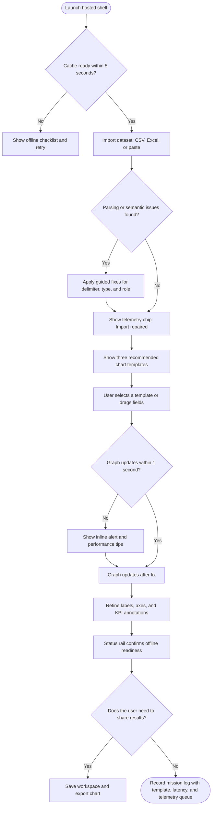
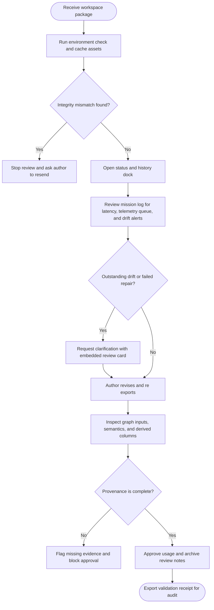

---
stepsCompleted:
  - step-01-init.md
  - step-02-discovery.md
  - step-03-core-experience.md
  - step-04-emotional-response.md
  - step-05-inspiration.md
  - step-06-design-system.md
  - step-07-defining-experience.md
  - step-08-visual-foundation.md
  - step-09-design-directions.md
  - step-10-user-journeys.md
  - step-11-component-strategy.md
  - step-12-ux-patterns.md
  - step-13-responsive-accessibility.md
  - step-14-complete.md
lastStep: 14
inputDocuments:
  - /home/pin81845/repo/BMADGraphWebApp/_bmad-output/planning-artifacts/product-brief-BMADGraphWebApp-2026-03-24.md
  - /home/pin81845/repo/BMADGraphWebApp/_bmad-output/planning-artifacts/prd.md
  - /home/pin81845/repo/BMADGraphWebApp/_bmad-output/planning-artifacts/prd-validation-report-2026-04-06.md
  - /home/pin81845/repo/BMADGraphWebApp/_bmad-output/planning-artifacts/prd-validation-report-2026-04-08.md
  - /home/pin81845/repo/BMADGraphWebApp/_bmad-output/planning-artifacts/sprint-change-proposal-2026-04-08.md
  - /home/pin81845/repo/BMADGraphWebApp/docs/essential-graphing.pdf
  - /home/pin81845/repo/BMADGraphWebApp/docs/essential-graphing.parsed.txt
---

# UX Design Specification BMADGraphWebApp

**Author:** Pinto
**Date:** 2026-04-08

---

<!-- UX design content will be appended sequentially through collaborative workflow steps -->

## Executive Summary

### Project Vision
BMADGraphWebApp now proves that engineers can open a centrally hosted browser shell, cache it locally within five seconds, and run the entire analytical loop—import, semantic correction, lightweight prep, graph building, stats, save/reopen—while their datasets, workspaces, and transforms never leave the local machine. The UX must keep this hybrid hosted/offline promise visible: launch through internal hosting with no per-user installs, confirm “Ready for offline use,” and let users resume trustworthy analyses even when the network drops.

### Target Users
- **David Mercer (non-technical domain engineer):** Needs a calm runway that makes the hosted shell feel as approachable as Excel while still guaranteeing offline continuity for travel/offsite reviews. He relies on semantic chips, KPI telemetry, and celebratory “Ready to graph” confirmations to stay confident without expert help.
- **Priya Raman (technical R&D engineer):** Demands investigative flow with dockable panes, derived columns, and rapid graph iteration that stays under the ≤1 s target even as the shell streams telemetry back once connectivity returns.
- **Elena Brooks (quality reviewer):** Trust hinges on provenance overlays, drift warnings, and evidence that travels with a workspace export. She reopens imported workspaces in BMADGraphWebApp review mode on her own machine rather than using shared live review, so authors must keep status signals clear before handing work off.

### Key Design Challenges
1. **Hosted shell transparency:** Communicate caching status, offline readiness, telemetry backlog, and update prompts without interrupting flow.
2. **Performance visibility on hybrid delivery:** Maintain ≤1 s editing latency despite service-worker caching and telemetry queues, and surface timing badges so users believe the KPI.
3. **Trust + provenance in offline/online transitions:** Keep drift alerts, semantic overrides, and handoff evidence aligned after reconnects so the interface never shows stale states even though the data stays local.
4. **Accessibility in dense analytical UI:** Preserve WCAG 2.1 AA focus, keyboard parity, and screen-reader narrations across calm cockpit, investigative dock, and the optional status/history overlays.

### Design Opportunities
1. **Confidence-first hosted onboarding:** Use environment checks, semantic chips, and calm copy to turn “hosted shell + local data” into an obvious benefit (fast updates, no installs, still private).
2. **Offline-aware telemetry storytelling:** Telemetry badges, backlog pills, and “Ready for offline use” confirmations can differentiate the product by showing KPI compliance instead of hiding network complexity.
3. **Status/history + drift repair UX:** A lightweight status panel with repair cards and export-ready provenance can make BMADGraphWebApp the most trustworthy graphing workspace in its class.
4. **Composable investigative canvas:** Responsive dock/pin patterns let Priya and David share one workspace model, reinforcing the “one state, many views” principle without fracturing performance budgets.

## Core User Experience

### Defining Experience
BMADGraphWebApp is an analytical flight deck: import → semantic correction → lightweight prep/derived columns → interactive graph + stats → save/reopen, all within one resilient workspace that never leaves the user’s machine. The hosted browser shell simply delivers and refreshes the cockpit; the experience centers on semantic chips, dockable panes, and telemetry-aware status rails that keep David and Priya in uninterrupted investigative flow. If the drag-and-drop canvas plus status/history panel stay coherent and sub-second, everything else follows.

### Platform Strategy
We target a desktop-class, mouse/keyboard-first web shell that precaches within ≤5 s and runs offline indefinitely; touch gestures are additive but not primary. Service-worker state, cache freshness, and telemetry backlog surface through a low-profile status rail rather than modal interruptions. High-resolution monitors, split panes, and assistive tech are supported by enforcing WCAG 2.1 AA focus order, strong keyboard parity, and predictable docking behavior—even when panes pin, undock, or collapse for offline mode.

### Effortless Interactions
- **Import & Semantics:** Schema issues get auto-diagnosed, with one-click fixes for delimiters, units, and missing data; semantic chips update instantly (<1 s) as fields move.
- **Status Transparency:** “Ready for offline use,” cache freshness, and telemetry backlog live in chips that escalate only when user action is needed, so the canvas stays calm.
- **Workspace Continuity:** Save/reopen is one command that restores graphs, transformations, and status/history settings; any drift or broken formula spawns actionable repair cards.
- **Status & History:** Lightweight provenance overlays stay synchronized with the active workspace and highlight what changed prior to export.

### Critical Success Moments
1. **First Ten Minutes:** David loads a real dataset, fixes a misread column, and sees “Ready to graph” plus a polished chart—all before minute ten.
2. **Messy Data Recovery:** Priya resolves a parsing or drift issue without leaving the workspace, proving the system replaces JMP escalations.
3. **Offline Confidence:** The shell confirms caching, the graphs stay ≤1 s responsive during a network drop, and telemetry queues quietly.
4. **Review Trust:** When Elena later imports a saved workspace into her review tooling, she immediately sees provenance, telemetry, and drift status were clean at the time of handoff, so she doesn’t have to reconstruct context.

### Experience Principles
1. **Hosted Transparency, Local Control** – Status rails communicate cache, updates, and telemetry without ever implying data leaves the device.
2. **Single Workspace, Many Facets** – Docked panes, chips, and the optional status/history panel all draw from the same analytical kernel so intent never fragments.
3. **Guided Independence** – Inline helpers, guardrails, and celebratory confirmations keep non-technical users self-sufficient without slowing experts.
4. **Performance = Trust** – Sub-second graph edits, ≤2 s transforms, and immediate drift alerts prove the workspace is serious-scale and reliable.

## Desired Emotional Response

### Primary Emotional Goals
- **Assured Control:** The workspace feels like a calm cockpit—users know exactly what’s happening and never fear losing their place.
- **Autonomous Mastery:** Priya and David experience self-directed success; the system makes them feel capable without needing expert rescue.
- **Collective Credibility:** Reviewers feel the output earns immediate organizational trust; sharing a workspace strengthens the team’s story.
- **Investigative Momentum:** Priya stays energized and in flow because the workspace keeps pace with her curiosity rather than slowing her down.

### Emotional Journey Mapping
1. **First Launch:** Curious reassurance—status chips confirm the hosted shell is cached, private, and offline-ready.
2. **Import / Prep:** Relief pulse—auto-detected schema fixes dissolve tension before it builds.
3. **Analytical Flow:** Flow-state focus—semantic chips, panes, and telemetry rails stay quiet unless action is truly needed.
4. **Issue Handling:** Predictable recovery—warning chips explain what’s off and how to fix it without panic.
5. **Completion / Save:** Mission acknowledgment—copy confirms “Workspace sealed; provenance current as of HH:MM.”
6. **Review / Reopen:** Collective confidence—status/history chips make it obvious what changed before the workspace was exported, so Elena can align with the author once she opens it elsewhere.
7. **Return Sessions:** Familiar trust—the cockpit looks identical on every reopen, reinforcing continuity.

### Micro-Emotions
- **Confidence over Confusion** when semantic chips update instantly.
- **Relief over Tension** when messy imports auto-correct.
- **Trust over Skepticism** via telemetry cues framed as reassurance.
- **Excitement over Anxiety** through sub-second graph edits even offline.
- **Alignment over Doubt** as the status/history panel captures drift history for later export.
- **Accomplishment over Frustration** when workspace reopen is exact and audit-ready.

### Design Implications
- **Assured Control →** low-noise status rail, mission-log style confirmations, no surprise modals.
- **Autonomous Mastery →** inline repair cards, undo-safe transforms, transparent provenance overlays.
- **Collective Credibility →** status/history chips that show what changed, when it changed, and what initiated it, plus audit-ready timestamps.
- **Investigative Momentum →** focus mode that hides nonessential chrome while keeping telemetry chips visible.
- **Relief Pulse →** micro-copy that explicitly says “Import repaired—delimiter corrected automatically.”
- **Predictable Recovery →** warning chips that pair cause + fix (“Telemetry queued (offline) — will sync on reconnection”).

### Emotional Design Principles
1. **Telemetry as Reassurance:** Status cues exist to prove stability, not to nag.
2. **Proof Beats Hype:** Every delight moment references evidence (performance badges, timestamps).
3. **Resilience at the Surface:** Offline, telemetry, and drift states surface before users worry.
4. **Shared Ownership:** Reviewer rails signal the workspace is a living artifact, encouraging confident collaboration.

## UX Pattern Analysis & Inspiration

### Inspiring Products Analysis
1. **Notion**
   - **Core solve:** Modular canvas that keeps complex information approachable through nesting, toggles, and calm typography.
   - **Onboarding:** Progressive disclosure—starter templates plus inline hints keep first-run anxiety low.
   - **Navigation:** Left rail + breadcrumbs reinforce spatial memory; keyboard palette accelerates power users.
   - **Interactions:** Drag-to-reorder blocks and “/” commands give mastery without clutter.
   - **Visual choices:** Muted chrome and generous spacing deliver Assured Control.
   - **Error handling:** Inline warnings and soft toasts keep context intact—our model for non-intrusive telemetry cues.

2. **Figma**
   - **Core solve:** Keeps investigative momentum even with heavy canvases; live cursors build collaboration trust.
   - **Onboarding:** Tutorials embedded directly in starter files demonstrate interactions in situ.
   - **Navigation:** Infinite canvas + page tabs mirror our “one workspace, many views” docking model.
   - **Innovations:** Comment threads, version history, and autosave badges show how evidence rails and mission logs can feel collaborative.
   - **Visual system:** High-contrast chrome with depth cues separates tools from canvas, reducing cognitive load.
   - **Error handling:** Autosave/offline badges live in the toolbar—exactly the telemetry reassurance tone we need.

3. **Linear**
   - **Core solve:** Command palette and ultra-focused task view keep users in flow.
   - **Navigation:** Palette-first navigation plus contextual keyboard hints provide accessible power without clutter.
   - **Interactions:** Focus mode hides chrome during deep work, giving Priya investigative momentum.
   - **Visual choices:** High-contrast, dark-friendly UI supports long sessions while keeping state obvious.
   - **Reliability cues:** Sync indicators sit next to the palette so status is always reachable via keyboard.

4. **Obsidian**
   - **Core solve:** Multi-pane knowledge graph without overwhelming the user.
   - **Navigation:** Collapsible sidebars and pane splitting let Priya dock evidence rails while David keeps a single calm view.
   - **Interactions:** Graph view + backlinks reinforce spatial memory—useful for our workspace mission log.
   - **Visual choices:** Subtle color coding and thin separators keep dense information legible.
   - **Error handling:** Warnings appear inline, preserving flow.

5. **Slack**
   - **Core solve:** Real-time messaging with graceful offline behavior.
   - **Telemetry cues:** “Message will send when you’re back online” banner balances honesty with reassurance.
   - **Visual system:** Status chips adopt the chroma of the channel header, keeping signals visible in light/dark modes.
   - **Interactions:** Command palette + shortcuts provide parity for mouse and keyboard users.

6. **Vercel Deployments / Datadog Notebooks**
   - **Core solve:** Mission log + timeline views that explain exactly what happened and when.
   - **Navigation:** Vertical timeline with filters lets teams audit events without losing context.
   - **Interactions:** Hover reveals precise timestamps and status; comments attach to moments, not generic notes.
   - **Visual choices:** Dark background with bright status pills reinforces “mission control” tone—perfect for our telemetry rail.

7. **JMP Graph Builder**
   - **Core solve:** Serious statistical graphing with rich drag targets.
   - **Onboarding:** Guided recipes and sample data reduce fear of advanced capabilities.
   - **Navigation:** Pill-based role assignments (X, Y, group) echo our semantic chips; seeing assignments reflected immediately reinforces trust.
   - **Interactions:** Instant recomputation and overlay stacking show how to keep investigative flow <1 s even when layering stats.
   - **Visual choices:** Dense but consistent iconography; gridlines and axis handles communicate precision.
   - **Error handling:** Blocking dialogs explain why a configuration is invalid—good reference for our “steady guidance” tone.

### Transferable UX Patterns
- **Navigation**
  - Notion rail + breadcrumbs anchor workspace/project hopping.
  - Figma tabbed pages + Obsidian split panes enable “one state, many views.”
  - Linear command palette ensures every action is keyboard-accessible.
- **Interaction**
  - Notion/Linear palette commands adapt to BMAD verbs (import, semantic fix, telemetry log).
  - Figma/JMP drag-to-role targets reinforce semantic chips with instant previews.
  - Slack-style offline banner copy keeps telemetry chips honest and reassuring.
- **Visual**
  - Calm chrome (Notion) + mission-control badges (Figma/Vercel) balance reassurance with precision.
  - Obsidian pane contrast keeps multi-pane evidence rails legible without overwhelming David.

### Anti-Patterns to Avoid
- **Hidden State Changes:** Silent autosave/offline transitions undermine Assured Control.
- **Palette Commands that Fail Offline:** Any command palette action must degrade gracefully without network.
- **Modal Overload:** Blocking dialogs break investigative momentum—prefer inline repair cards.
- **Over-gamified Celebrations:** Confetti clashes with the mission-control tone; stick to mission acknowledgments.
- **Telemetry Badges that Disappear in Dark Mode:** Status cues need WCAG-compliant contrast everywhere.
- **Unbounded Toolbars:** Dense, always-on expert UI overwhelms David; progressive disclosure only.

### Design Inspiration Strategy
- **Adopt**
  - Notion’s calm chrome + contextual helper copy for onboarding.
  - Figma/Slack autosave + offline badges as telemetry reassurance.
  - Linear’s command palette for fast task switching with keyboard parity.
  - Vercel/Datadog mission logs to anchor the provenance timeline.
  - JMP Graph Builder’s drag-to-role chips and instant recompute loop to prove BMAD can match the proven analytical feel.
- **Adapt**
  - Obsidian split panes into configurable evidence rails (collapsible for David, expandable for Priya).
  - Slack’s offline banner tone into telemetry chips (“Will sync when back online”).
  - Figma comment threads into reviewer presence + drift notes within evidence rails.
- **Avoid**
  - Silent auto-fixes without explanation.
  - Palette actions that require network acknowledgments to complete.
  - Confetti or loud success animations that break the calm cockpit.
  - Dark-mode-only status cues; maintain WCAG contrast in both themes.

## Design System Foundation

### 1.1 Design System Choice
**Base UI + BMAD Mission Control Layer** – we rely exclusively on `@base-ui/react` primitives for behavior/accessibility and layer a custom token library plus component styles that match the “hosted mission control” aesthetic.

### Rationale for Selection
- **Long-term support:** Base UI is now MUI’s primary investment area (v1+), so we inherit an actively maintained accessibility layer without depending on paused projects.
- **Full visual control:** Unstyled primitives mean cockpit chrome, telemetry rails, and offline banners follow our tokens exactly—no upstream material/joy opinions to override.
- **Performance-aware:** Headless components keep bundle size low and make it easy to tree-shake unused interactions so we stay within the ≤5 s caching target.
- **Clear ownership:** Owning the styling layer avoids split-brain “theme pack vs. Base” rules; every BMAD component documents whether it’s a thin wrapper (e.g., combobox) or a bespoke build (e.g., telemetry rail) so contributors know the single source of truth.

### Implementation Approach
1. **Tech stack:** React + Vite (or Next) with TypeScript, importing `@base-ui/react` primitives only; all styling lives in our Mission Control token system (CSS variables + utility classes) defined under `_bmad-output/design-system`.
2. **Component zoning doc:** Maintain a Storybook grid that lists each BMAD component, the Base UI primitive(s) it wraps, and any custom behaviors (telemetry queue indicators, provenance overlays, etc.).
3. **Performance plan:** Keep Base UI imports granular, leverage Suspense/lazy routes, and ensure the service worker precaches only core shells while streaming mission-control components as needed.
4. **Storybook + tokens:** Stand up Storybook early; define the token set (colors, typography, spacing, motion) once and consume it from Base UI wrappers plus bespoke components so the ledger/status rails stay visually consistent.

### Customization Strategy
- **Palette:** Define cockpit tokens (neutrals, telemetry states, drift alerts) inside our Mission Control theme and apply them through CSS variables consumed by Base UI parts.
- **Typography:** Use our own scale derived from Inter + JetBrains Mono (documented below) so headings, chips, and telemetry readouts stay consistent without upstream presets.
- **Component themes:**
  - Telemetry chips: Base UI `Badge` composition + Mission Control tokens for ready/queued/offline states.
  - Evidence rails: Base UI `Tabs`/`Accordion` primitives combined with custom reviewer cards, drift alerts, and provenance metadata panels.
  - Command palette: Base UI `Modal` + keyboard-first focus styles defined in our token set, with offline-safe command feedback baked into the wrapper.
- **Documentation:** Capture mission-control patterns (status rails, evidence rails, command palette) in Storybook with accessibility + offline notes so future engineers extend the custom layer instead of reaching for external themed kits.

## 2. Core User Experience

### 2.1 Defining Experience
BMADGraphWebApp’s signature moment is the five-second graph launch. A dataset lands in the hosted shell, recommended chart templates appear for the locked MVP graph families, and semantic chips snap into the X/Y/Color/Facet docks so the canvas instantly displays a trustworthy graph. David can pick a suggested template and get a presentation-ready chart without digging; Priya can iterate through the supported MVP graph patterns while keeping transforms and layers intact; Elena can later reopen the workspace in review mode with confidence because provenance badges and telemetry/offline status were pinned beside the canvas at handoff. If we perfect that drag-to-role graph builder—complete with template-assisted first graph generation, sub-second updates, statistical overlays, and always-on provenance rails—the core product promise holds without assuming every stretch graph pattern ships in MVP.

### 2.2 User Mental Model
- **David (Excel mindset):** Expects a direct-manipulation chart builder where whatever he tweaks on screen—axes, colors, labels—is exactly what he’ll export, with obvious axis roles, reusable templates, and guidance when semantics look off. Graphs should feel like “better Excel,” not a new language.
- **Priya (JMP mindset):** Thinks in role pills, layered plots, and rapid context switching between supported MVP graph views without losing derived columns or filters. She expects statistical overlays and evidence rails to stay anchored to the same graph surface even offline, while optional stretch patterns such as dual-axis and ridgeline views remain explicitly labeled if deferred.
- **Elena (quality reviewer):** Needs every chart to reveal what fields, filters, and transforms power it, plus drift/telemetry cues before the visual renders so she can trust it once she imports the author’s workspace into local review mode.
- **Frustrations today:** Excel crumbles under serious data; JMP demands expert rituals. All three personas hate losing a crafted chart when reopening or when the network flickers, so they resort to fragile shortcuts (duplicated sheets, screenshots, multiple tool windows). Hidden recalculations, unclear layer inputs, and modal interruptions derail confidence fastest.

### 2.3 Success Criteria
- **Graph creation speed:** Import → semantic confirm → first template-backed graph in ≤10 minutes for David, with every role or template change rendering in ≤1 s and every transform/facet recompute finishing in ≤2 s—even offline.
- **Layer credibility:** Users can stack at least four encodings (axes + color/size/facet) plus one statistical overlay without frame drops; telemetry badges confirm these edits stay within SLA whether online or cached.
- **Workspace reusability:** Saving the workspace captures dataset semantics, transform stack, derived columns, template choice, layer order, annotations, telemetry state, and review annotations; reopening restores that full ledger with highlighted deltas and drift warnings before the graph loads.
- **Feedback transparency:** Status badges pair each graph edit with confidence copy (“Spline fit applied—latency 0.7 s, telemetry queued offline”), and inline repair cards point to misconfigured axes or incompatible templates without hiding the canvas.
- **Reviewer readiness:** Provenance/status signals surface what changed, when it changed, and what initiated it so authors can export a workspace that stands on its own when Elena reviews it later.

### 2.4 Novel UX Patterns
- **Established pieces:** Drag-to-role targets, template ribbons, small-multiple grids, layer toggles, and dockable panes draw from JMP Graph Builder, Tableau, and Obsidian/Figma pane systems so graph aficionados feel instantly oriented.
- **BMAD twists:** Hosted-shell telemetry and offline readiness live directly in the graph toolbar; evidence rails pair review annotations with per-layer provenance; template swaps never hide layer context; saving emits a mission-log-style ledger for each chart; reopening highlights delta badges before render.
- **Education plan:** First-run tooltips map each dock to familiar tools (“Color behaves like JMP Group / Excel Series”), explain telemetry chips, and show how reviewer rails track provenance. Palette hints expose keyboard shortcuts for swapping templates, cycling overlays, or opening the ledger so both David and Priya ramp fast.

### 2.5 Experience Mechanics
**Initiation**
- Import panel previews graph-ready schema, flags ambiguous columns, and proposes two or three locked-MVP chart templates (“Scatter with regression,” “Line trend,” “Grouped bar comparison”). Telemetry/offline badge confirms cache readiness before graphing starts.
- Empty canvas shows labeled drop zones plus template thumbnails, nudging David to “click to graph” while Priya can drag fields immediately.

**Interaction**
- Users drag chips or apply a suggested template; chart type ribbon updates live for the supported MVP graph types, while optional stretch patterns remain clearly labeled if present in a prototype or later release. Layer drawer lets Priya toggle the supported regression fit, reference lines, threshold bands, and annotations; optional KPI-card-style embellishments remain outside the locked MVP unless explicitly approved.
- Derived-column composer and filters sit adjacent so formula edits instantly feed new encodings; dockable panes let Priya pin the evidence rail while David collapses it.

**Feedback**
- Inline micro-toasts anchored to the graph frame report latency, template results, or semantic conflicts (“Facet grid ready in 0.9 s,” “Color encoding limited to categorical fields”).
- Telemetry/offline chips pulse quietly when metrics queue, and light-weight status/history badges show what each layer references. Drift or broken formulas trigger alerts before the graph renders so the workspace is trustworthy when Elena eventually inspects it.

**Completion**
- “Save Workspace” seals the graph state, transform stack, template choice, and review annotations; confirmation copy references the active chart in the current build (“Reference graph + fit saved at 14:05—offline-ready, telemetry queued 3 metrics”).
- Reopen flow previews the prior visual, highlights changes (new layer, updated transform), and surfaces drift/telemetry warnings before loading the canvas. Users can jump directly to the graph builder with all encodings intact, ensuring continuity for both David and Priya while making it easy to hand off a self-explanatory workspace for Elena’s later import.

### 2.6 MVP Scope Labels

- The exact MVP family list, template IDs, overlay set, and blocked combinations are defined in [core-graph-catalog.md](/home/pin81845/repo/BMADGraphWebApp/_bmad-output/planning-artifacts/core-graph-catalog.md).
- **Locked MVP:** template-assisted first graph creation, role-based graph editing, supported core graph families, one graph-tied fit path, reference-graph promotion, evidence rail, mission log, and handoff readiness.
- **Optional MVP stretch:** dual-axis comparison, ridgeline small multiples, deeper template-gallery breadth, and KPI-card-heavy graph embellishments that do not strengthen the minimum trust workflow.
- **Future inspiration:** broader chart-pattern parity with expert-first analytics tools, expansive reusable template libraries, and advanced visual flourishes not needed to prove the core analytical loop.

## Visual Design Foundation

### Color System
- **Mission Control Palette:** Cool gray neutrals (#F5F7FB surface, #1F2430 text) keep the cockpit calm, while a saturated teal (#1BB1A8) signals “ready/healthy,” a deep indigo (#3246C5) anchors primary actions, and saffron (#F3A63B) plus crimson (#E24B4B) cover warning/error telemetry. This mirrors the emotional goals—Assured Control and Investigative Momentum—by pairing quiet chrome with confident signals.
- **Semantic Mapping:** Primary actions & graph handles use indigo #3246C5; secondary controls and evidence rail tabs use slate #3C485C; success/ready states use teal #1BB1A8; warning/drift uses saffron #F3A63B; error/telemetry failure uses crimson #E24B4B; backgrounds ladder from surface #F5F7FB to panel #E4E9F4, white canvas #FFFFFF, and a deep mission rail #161B26.
- **State Behavior:** Hover lightens fills by ~6%, pressed darkens by ~8%. Offline telemetry chips use teal outlines with neutral fills; queued state adds a saffron pulse. Disabled elements drop to 30% opacity but still meet contrast.
- **Accessibility:** Primary text/background combos exceed 4.5:1; badges switch to white text when fill is darker than #666, otherwise charcoal text. Semantic colors were checked against WCAG AA for both light and dark surfaces.

### Typography System
- **Primary Typeface:** Inter (variable) for UI chrome, tables, and body content—clean, modern, and aligned with our Mission Control tokens.
- **Secondary Typeface:** JetBrains Mono for telemetry readouts, provenance timestamps, formula editors, and KPI badges, reinforcing the mission-control tone.
- **Type Scale (1.125 modular):** Display 40/48px, H1 32/40px, H2 24/32px, H3 20/28px, Body L 16/24px, Body S 14/20px, Mono 13/20px. Headline spacing: 32px top / 16px bottom; body paragraphs use 8px separations.
- **Tone & Accessibility:** Professional and modern with high legibility in dense analytical contexts; minimum body size 14px, default editable text 16px to keep WCAG readability.

### Spacing & Layout Foundation
- **Base Grid:** 8px spacing system aligned with the Mission Control token set built atop Base UI. Components snap to 8/16/24/32 multiples, ensuring consistent rhythm even in compact analytics mode.
- **Density Modes:** Standard panels use 16px padding; compact analytics mode reduces vertical padding to 12px but retains the 8px grid. Docked evidence/telemetry rails keep widths in 64px increments for predictable docking.
- **Grid Structure:** 12-column responsive grid (72px columns / 24px gutters) on desktop. Mission rail reserves fixed 280px on the left; central canvas spans remaining columns. Overlays respect 40px outer margins on ≥1440px screens.
- **White Space:** Graph canvas includes 24px outer padding; docked panes drop to 16px. Button clusters maintain 8px gaps; template thumbnails rest on 16px cards for scannability.

### Accessibility Considerations
- All semantic pairs meet WCAG 2.1 AA contrast; telemetry badges combine icon + label text so color alone never conveys status.
- Focus states: 2px teal inner ring plus 1px outer halo ensure visibility on light/dark surfaces. Keyboard navigation order mirrors visual layout, and all controls maintain ≥44px touch targets even though desktop-first.
- Motion guidelines cap telemetry pulses/hover animations at 200 ms with reduced-motion fallbacks.
- Dark mode plan: invert neutrals (#0F141C background, #E3E9F5 text) while shifting semantic hues (teal → #2ED7CC, saffron → #FFC472) to preserve status recognition offline.

## Design Direction Decision

### Design Directions Explored
1. **Mission Control Focus** — graph-first cockpit with telemetry/status chips always visible.
2. **Calm Analyst** — airy, template-guided surface for David’s first graphs.
3. **Split Horizon** — dual-column layout emphasizing graph + status/history on widescreens.
4. **Telemetry Stream** — graph plus live telemetry spine when network storytelling matters most.
5. **Template Gallery** — template-first onboarding before entering the cockpit.
6. **Status & History Dock** — lightweight status panel (replaces the old reviewer dock) for handoff context.

### Chosen Direction
Hybrid of Mission Control Focus (core shell), Template Gallery (onboarding/new graph workflow), and Status & History dock. Split Horizon rules inform large-screen layouts so status/history can pin beside the canvas without crowding smaller viewports.

### Design Rationale
- Graph canvas stays primary with mission rail + telemetry chips so Priya and David always see performance/offline readiness.
- Template Gallery shortens David’s path to a KPI-proof first graph (≤1 s edits, ≤2 s transforms surfaced upfront).
- Status & History dock shows only “Last Saved” and “Drift” chips by default, with an optional drawer listing recent events for clean handoff to Elena’s external review tools.
- Saving triggers a mission-log style confirmation so exported workspaces carry the same provenance/status context.

### Implementation Approach
1. Build the Mission Control layout as the default app chrome (dark rail, light canvas, telemetry chips, role rail for advanced layers).
2. Layer the Template Gallery on top of that shell for first-run and “New Graph” flows, reusing the same tokens/components.
3. Implement a collapsible Status & History dock with always-on chips and an optional drawer for recent actions; ensure it’s hidden by default but keyboard accessible.
4. Apply Split Horizon behavior on ≥1440 px screens (status/history can pin beside the graph) while keeping it as a bottom drawer on smaller layouts.

## User Journey Flows

### David Mercer - First Report-Ready Graph

David's journey proves a non-technical engineer can launch the hosted shell, import data, fix semantics, and create a publishable chart within 10 minutes while staying confident the workspace is cached for offline use.

Flow notes:
- Entry point is the hosted shell, not a local install, so cache readiness is the first trust check.
- The key recovery pattern is guided import repair without leaving the flow.
- Success is visible through the graph result, offline-ready confirmation, and mission-log feedback.

### Priya Raman - Investigate Failure and Preserve Analysis

Priya's journey centers on hypothesis-driven analysis. She needs to move from a technical question to a defendable workspace record without losing speed or analytical clarity. The interface must let her explore multiple candidate views, promote one of them into evidence, and preserve the logic that made that graph worth saving.

```mermaid
flowchart TD
  P0([Open saved workspace or start a new investigation]) --> P1{"Resume prior investigation?"}
  P1 -- Yes --> P1a[Restore dataset, notes, reference graph, and prior evidence]
  P1 -- No --> P1b[Load dataset and enter investigation question]
  P1a --> P2[Confirm semantics, units, and key fields]
  P1b --> P2
  P2 --> P3{"Any semantic ambiguity or field conflicts?"}
  P3 -- Yes --> P3a[Resolve types, roles, units, and missing-value rules]
  P3a --> P4[Create derived columns and formulas]
  P3 -- No --> P4
  P4 --> P5{"Any formula errors or stale dependencies?"}
  P5 -- Yes --> P5a[Repair dependency chain or undo recent changes]
  P5a --> P4
  P5 -- No --> P6[Build first analytical view]
  P6 --> P7[Open alternate comparison views as needed]
  P7 --> P8{"Candidate view worth keeping?"}
  P8 -- No --> P7
  P8 -- Yes --> P9[Promote selected view to reference graph]
  P9 --> P10[Attach notes, overlays, and reasoning in evidence rail]
  P10 --> P11{"Drift, anomaly, or conflicting result detected?"}
  P11 -- Yes --> P11a[Show repair card and recompute affected graphs and evidence]
  P11a --> P12
  P11 -- No --> P12
  P12 --> P13{"Interaction stays within 2 second target?"}
  P13 -- No --> P13a[Offer simplified rendering, sampling, or reduced overlays]
  P13a --> P14[Continue investigation with performance guidance]
  P13 -- Yes --> P14
  P14 --> P15{"Ready to preserve or hand off?"}
  P15 -- No --> P7
  P15 -- Yes --> P16[Run handoff readiness check for drift, notes, telemetry, and provenance]
  P16 --> P17{"Any blocking issues remain?"}
  P17 -- Yes --> P17a[Jump directly to the missing or invalid evidence]
  P17a --> P7
  P17 -- No --> P18[Save mission log with reference graph, transforms, and telemetry state]
  P18 --> P19([Export workspace snapshot for Elena or resume later])
```

Flow notes:
- Priya now starts from an investigation question, not from platform maintenance.
- Alternate views remain exploratory until one is promoted to the reference graph.
- Evidence capture happens immediately after promotion, which makes the analytical chain easier to trust later.
- Telemetry stays relevant at save and handoff time without dominating the middle of the investigation.
- Blocking handoff issues route Priya back to the exact missing evidence path instead of forcing a vague restart.

### Elena Brooks - Review and Validate Workspace

Elena validates that a workspace reopened in BMADGraphWebApp review mode on her own machine is trustworthy before the graph enters quality discussions, focusing on provenance, drift, and telemetry integrity.

Flow notes:
- Elena's journey is review-first, so integrity and provenance checks happen before visual trust.
- Missing evidence blocks approval explicitly rather than allowing soft ambiguity.
- The result is an audit-ready validation receipt, not just a subjective sign-off.

### Journey Patterns

- Navigation pattern: every journey starts with environment or cache validation before exposing core work.
- Navigation pattern: dockable areas such as canvas, status/history, and evidence rail preserve one shared workspace state.
- Decision pattern: each journey includes an explicit trust gate before the user advances.
- Decision pattern: recovery is handled inline through repair cards, guided fixes, or resend requests instead of disruptive modal flows.
- Feedback pattern: telemetry, latency, and drift signals are always paired with plain-language status.
- Feedback pattern: mission-log entries act as completion feedback and handoff evidence.

### Flow Optimization Principles

- Minimize time to value by surfacing templates, semantic fixes, and graph readiness immediately after import.
- Preserve investigative momentum by keeping performance and telemetry signals visible but non-blocking.
- Expose trust states early so users do not invest effort in work that later fails validation.
- Make every failure recoverable inside the current context with retry, repair, undo, or clarification loops.
- Keep handoff artifacts self-explanatory so Elena can assess workspace credibility without relying on the original author.

## Component Strategy

### Design System Components

BMADGraphWebApp uses Base UI only for interaction behavior, accessibility primitives, and state management. All application-facing styling, analytical semantics, and trust patterns live in the BMAD Mission Control layer.

**Base UI foundation components**
- Dialog and Popover primitives for contextual actions, lightweight confirmations, and command surfaces
- Tabs for graph workspaces, evidence views, and status/history navigation
- Accordion for expandable diagnostic detail, audit summaries, and repair explanations
- Select, Combobox, and Menu for semantic-role selection, template switching, and graph actions
- Checkbox, Radio, Switch, and Button primitives for overlays, options, and display controls
- Tooltip for compact explanatory guidance on telemetry, provenance, and semantic states
- Badge as the base primitive for status chips and compact state indicators
- Modal and focus-management primitives for the command palette and blocking recovery flows

**Thin wrapper components built from Base UI**
- Standard buttons, chips, menus, drawers, dialogs, and tab shells
- Form controls for import, semantic correction, filter setup, and graph options
- Shared panel, card, and list patterns used inside mission-control surfaces

**Gaps requiring custom BMAD components**
- Analytical role-assignment surfaces
- Trust and repair surfaces that combine diagnosis with action
- Provenance and evidence management surfaces
- Investigation-state components for promoted reference graphs
- Handoff and review-readiness surfaces

### Custom Components

### Telemetry Status Rail

**Purpose:** Communicates shell readiness, offline status, sync backlog, and performance health without interrupting analytical work.  
**Usage:** Persistent global rail in all graphing and review sessions.  
**Anatomy:** readiness chip, queue chip, performance indicator, update state, expandable details affordance.  
**States:** healthy, offline-ready, queued, syncing, degraded, warning, error.  
**Variants:** compact rail, expanded rail, narrow-screen summary bar.  
**Accessibility:** critical state changes use concise live-region announcements; all chips expose status text beyond color.  
**Interaction Behavior:** stays passive by default and expands for diagnostics, retry, and update detail.

### Semantic Role Dock

**Purpose:** Supports field-to-role assignment for analytical graph construction.  
**Usage:** Primary graph-builder surface for David and Priya.  
**Anatomy:** role slots, field chips, compatibility hints, inline validation, quick-clear actions.  
**States:** empty, populated, suggested, incompatible, locked, error.  
**Variants:** guided mode with hints, dense expert mode.  
**Accessibility:** full keyboard alternative to drag/drop; reassignment is announced with role and field name.  
**Interaction Behavior:** supports drag, click-to-assign, reorder, and immediate compatibility feedback.

### Repair Card

**Purpose:** Converts a detected issue into a clear explanation plus direct recovery actions.  
**Usage:** Import issues, semantic ambiguity, stale formulas, drift, integrity mismatches, handoff blockers.  
**Anatomy:** issue title, concise explanation, recommended action, secondary actions, details toggle.  
**States:** informational, warning, blocking, resolved.  
**Variants:** inline card, docked card, stacked issue list item.  
**Accessibility:** blocking variants use alert semantics; action labels describe the recovery outcome directly.  
**Interaction Behavior:** supports repair, inspect, undo, and defer without forcing users out of context.

### Evidence Rail

**Purpose:** Captures the reasoning, provenance, overlays, and reviewer context attached to the current reference graph.  
**Usage:** Investigation and review workflows where analytical conclusions must remain inspectable.  
**Anatomy:** notes stream, transform summary, provenance block, overlay controls, review annotations, unresolved issue callouts.  
**States:** collapsed, pinned, filtered, unresolved, review-ready.  
**Variants:** side rail, split-horizon rail, bottom drawer.  
**Accessibility:** section order is keyboard navigable; notes, markers, and provenance entries all expose plain-text equivalents.  
**Interaction Behavior:** follows the reference graph rather than merely the frontmost tab so evidence stays attached to the graph that matters.

### Reference Graph Marker

**Purpose:** Distinguishes exploratory views from the graph that currently represents the working analytical conclusion.  
**Usage:** Priya's multi-view investigative workflow and any later review or export flow.  
**Anatomy:** current-state badge, promote action, reason prompt, change history hook.  
**States:** exploratory, candidate, reference, stale, superseded.  
**Variants:** tab badge, canvas header marker, compact label.  
**Accessibility:** changes announce the new reference graph and the previous one it replaced.  
**Interaction Behavior:** promoting a graph updates the Evidence Rail, Mission Log, and handoff context to follow that graph.

### Mission Log Panel

**Purpose:** Records meaningful analytical events and gives users a readable history of what changed across the workspace.  
**Usage:** Session feedback, saved-state confirmation, and review context.  
**Anatomy:** event list, timestamps, graph association, origin label, telemetry snapshot, filter controls.  
**States:** active, filtered, queued, saved, exported.  
**Variants:** inline confirmation panel, history drawer, compact summary list.  
**Accessibility:** every event is readable as standalone text without visual cues; timestamps and event types are keyboard accessible.  
**Interaction Behavior:** logs structural events such as promoted graph changes, formula repairs, drift resolution, save/export actions, and telemetry state at the time of save.

### Handoff Readiness Panel

**Purpose:** Determines whether the workspace is complete enough to save, export, or send for review.  
**Usage:** Final checkpoint before handoff and fast trust summary when reopening a workspace.  
**Anatomy:** readiness checklist, blocking issues, warning issues, provenance completeness, telemetry state, action links.  
**States:** ready, warning, blocked, exported.  
**Variants:** summary card, full checklist drawer.  
**Accessibility:** checklist items use explicit status text and semantic list structure; blocked items are announced clearly.  
**Interaction Behavior:** links each failing item back to the exact unresolved graph, note, drift issue, or missing provenance entry rather than sending users into a generic editing loop.

### Workspace Snapshot Export Card

**Purpose:** Summarizes exactly what will be preserved at export time so authors and reviewers know what evidence travels with the workspace.  
**Usage:** Save and export moments for Priya and review intake for Elena.  
**Anatomy:** reference graph summary, transform count, notes status, provenance summary, telemetry snapshot, export action.  
**States:** draft, ready, blocked, exported.  
**Variants:** inline card, confirmation summary.  
**Accessibility:** export contents are described in plain language and not implied through icons alone.  
**Interaction Behavior:** reflects the current handoff state and confirms which reference graph and evidence set are included.

### Component Implementation Strategy

**Foundation strategy**
- Use Base UI only for primitives, focus management, layering, and interaction state.
- Keep all BMAD-specific styling, copy patterns, and analytical semantics inside wrapper and custom Mission Control components.
- Avoid a second styled component library to prevent design drift and duplicated semantics.

**Composition strategy**
- Build thin wrappers for generic controls first: buttons, chips, drawers, dialogs, menus, tab shells.
- Build true custom components only where product meaning depends on them: role assignment, evidence, reference graph state, repair, readiness, export summary.
- Keep workflow ownership clear: the Evidence Rail explains the active conclusion, the Mission Log records events, and the Handoff Readiness Panel evaluates whether handoff is allowed.

**State strategy**
- Reference graph state is global to the workspace and must be observable by Evidence Rail, Mission Log, Handoff Readiness, and export flows.
- Trust-state components must consume shared signals for drift, formula validity, unresolved notes, and telemetry state.
- Exploratory graph tabs remain lightweight and disposable until explicitly promoted.

**Accessibility strategy**
- Every analytical state must be readable through text, not just badge color or placement.
- Keyboard parity is required for role assignment, graph promotion, issue repair, and review flows.
- Blocking issues interrupt only when user action is required; informational telemetry remains ambient.

**Documentation strategy**
- Each custom component gets Storybook coverage for anatomy, states, keyboard behavior, and sample content.
- Components that participate in trust or handoff flows also document their upstream inputs and downstream effects.

### Implementation Roadmap

**Phase 1 - Core graphing and trust**
- Semantic Role Dock
- Telemetry Status Rail
- Repair Card
- Mission Log Panel

**Phase 2 - Investigation workflow**
- Reference Graph Marker
- Evidence Rail
- Graph-promotion interactions that connect tabs, evidence, and mission-log state

**Phase 3 - Handoff and review**
- Handoff Readiness Panel
- Workspace Snapshot Export Card
- Review-specific evidence and status refinements for Elena workflows

**Phase 4 - Refinement and responsive variants**
- Dense expert-mode variants for Priya
- Compact responsive variants for narrower review contexts
- Advanced evidence filtering and comparison tools

## UX Consistency Patterns

### Button Hierarchy

**When to Use:** Use button hierarchy whenever users must choose between advancing analysis, repairing trust, or performing supporting actions.  
**Visual Design:** One primary action per surface. Primary actions carry the strongest emphasis. Secondary actions are visible but clearly subordinate. Tertiary actions are reserved for inspection, dismissal, or optional utilities. Destructive actions use warning styling and explicit consequence language.  
**Behavior:** Primary actions advance the current analytical goal. Secondary actions support review, retry, or alternate exploration. Tertiary actions never compete visually with save, repair, promote, or export actions.  
**Accessibility:** Labels describe the result of the action. Disabled states include explanatory text. Keyboard focus follows the same priority order as the visual hierarchy.  
**Mobile Considerations:** Preserve one visible primary action and collapse lower-priority actions into overflow or drawers.  
**Variants:** primary, secondary, tertiary, destructive, blocking-repair.

**Button rules**
- Each region has one primary action only.
- "Promote to Reference" is the primary action in candidate-graph review states.
- "Repair" outranks "Dismiss" whenever analytical trust is affected.
- "Export Snapshot" cannot be primary when handoff readiness is blocked.

### Feedback Patterns

**When to Use:** Use feedback patterns to explain analytical status, trust state, and recovery options.  
**Visual Design:** Feedback appears at three levels: ambient, inline, and blocking. Ambient feedback uses compact chips or indicators. Inline feedback appears as attached explanatory surfaces. Blocking feedback interrupts only when user action is required to preserve correctness or complete handoff.  
**Behavior:** Feedback always answers three questions: what happened, why it matters, and what can be done next. Ambient telemetry should remain visible without interrupting flow. Inline trust failures should remain anchored to the affected graph, field, or panel. Blocking states must include a direct recovery path.  
**Accessibility:** Every status is represented with text and iconography; live-region announcements are reserved for blocking or high-importance changes.  
**Mobile Considerations:** Compact ambient indicators into a summary bar and reveal detail in a sheet or drawer.  
**Variants:** success, info, warning, blocking, resolved.

**Feedback rules**
- Telemetry remains ambient unless it affects save, export, or trust.
- Drift, stale formulas, and semantic conflicts appear inline next to the affected context.
- Success messages confirm preserved analytical value, not just system completion.
- Blocking feedback always links to the exact unresolved source.

### Form Patterns

**When to Use:** Use form patterns for semantic correction, formula creation, filters, annotations, and review metadata.  
**Visual Design:** Forms use explicit labels, concise helper text, and inline validation adjacent to the field. Dense layouts are allowed only when analytical comparisons require them.  
**Behavior:** Validation happens early and locally. Users should understand whether an input is valid before leaving the current analytical step. Multi-step corrective flows should confirm progress incrementally rather than delaying all validation until submission.  
**Accessibility:** Each field includes programmatically associated label, helper text where needed, and error text when invalid. Keyboard users must be able to complete all analytical editing flows without drag dependency.  
**Mobile Considerations:** Use stacked layouts and reduce simultaneous field density.  
**Variants:** quick fix form, semantic editor, formula editor, filter builder, annotation editor.

**Form rules**
- Semantic assignment validates immediately after role change.
- Formula editors must reveal dependency validity before users move on.
- Required review or handoff fields are always explicit.
- Undo is preferred over confirmation dialogs for recoverable edits.

### Navigation Patterns

**When to Use:** Use navigation patterns to preserve the workspace mental model across graphing, investigation, and review.  
**Visual Design:** Navigation is divided into shell navigation, workspace navigation, and contextual support surfaces. The shell frames the session. Workspace navigation changes the active graph or investigation surface. Contextual support surfaces reveal evidence, status, and history without replacing the main task area.  
**Behavior:** The user must always be able to answer three questions: where am I, what graph is active, and what graph is the current reference. Opening or inspecting a graph does not automatically promote it. Evidence and handoff context follow the reference graph, not the frontmost exploratory tab.  
**Accessibility:** Landmarks, headings, tab semantics, and drawer labels must clearly distinguish shell, canvas, and support areas.  
**Mobile Considerations:** Side rails become bottom sheets or segmented panels without changing the underlying structure.  
**Variants:** shell rail, graph tabs, evidence rail, status/history dock, command palette.

**Navigation rules**
- Active tab and reference graph are separate states and must never be visually conflated.
- Opening a new tab never changes reference state automatically.
- Evidence Rail follows the reference graph.
- Status and History remain accessible from every major workspace state.

### Modal and Overlay Patterns

**When to Use:** Use overlays only when focus isolation is necessary.  
**Visual Design:** Prefer inline and docked solutions first. Use drawers for extended context. Reserve blocking modals for integrity failures, destructive actions, and contained command workflows.  
**Behavior:** Overlays must preserve user orientation and return users to the same analytical context after dismissal. If a blocking overlay appears, it must explain why in-context recovery was insufficient.  
**Accessibility:** Focus is trapped only when appropriate, dismissal behavior is explicit, and keyboard return lands users back in the triggering context.  
**Mobile Considerations:** Large dialogs convert to full-height sheets.  
**Variants:** command palette modal, integrity modal, drawer, bottom sheet.

**Overlay rules**
- Repair happens inline whenever possible.
- Handoff blockers should prefer checklist drawers before escalating to modals.
- Reviewer clarification flows should remain docked or inline.

### Empty, Loading, and Transitional States

**When to Use:** Use these states whenever the workspace lacks needed analytical context or is waiting on a meaningful transition.  
**Visual Design:** Empty states are instructional and action-oriented. Loading states explain what is in progress. Transitional states explain what changed and what remains available.  
**Behavior:** The system must clearly distinguish between nothing created yet, something missing, something invalid, and something still loading. Transitional states should preserve surrounding context so users do not lose orientation during recompute, promotion, or save/export.  
**Accessibility:** State messaging includes descriptive text and progress expectation where possible.  
**Mobile Considerations:** The next recommended action remains visible without requiring extra scrolling.  
**Variants:** first-run empty state, no-reference-graph state, recompute state, blocked-handoff state, invalid-evidence state.

**State rules**
- "No reference graph selected" is distinct from "graph loading" and from "reference graph invalid."
- David's first graph empty state always points to the next valid action.
- Elena's review flow distinguishes missing evidence, loading evidence, and blocked evidence.

### Search and Filtering Patterns

**When to Use:** Use search and filtering in evidence, mission log, dataset fields, and review workflows.  
**Visual Design:** Filtering controls stay close to the content they affect and summarize active scope clearly.  
**Behavior:** Filters are additive, reversible, and visible at all times. Search results should explain why an item matched. Filtering must not hide unresolved issues by default when trust is at stake.  
**Accessibility:** Active filters are represented as readable removable tokens. Search inputs expose both purpose and scope.  
**Mobile Considerations:** Advanced filters move into sheets or drawers, but active-filter summaries remain persistent.  
**Variants:** quick search, scoped filter bar, advanced evidence filter panel.

**Filtering rules**
- Unresolved issues remain visible or recoverable even under filtering.
- Mission Log filters support graph, event type, and handoff relevance.
- Dataset search supports semantic-role workflows, not just raw field lookup.

### Cross-Pattern Rules

- Trust-critical actions always outrank convenience actions.
- Reference graph state remains visible anywhere a user can save, export, annotate, or review.
- Every blocked state includes a direct recovery path tied to the failing context.
- Ambient telemetry remains visible but does not dominate investigation flow.
- Export and handoff patterns summarize included evidence, not just export success.

## Responsive Design & Accessibility

### Responsive Strategy

BMADGraphWebApp is a desktop-first analytical workspace. Desktop is the required experience and the product must be fully optimized for desktop authoring, investigation, and review. Tablet and mobile support are stretch goals only where they can be added without weakening desktop capability, density, clarity, or performance.

**Desktop strategy**
- Desktop is the canonical experience for graph authoring, semantic correction, derived columns, multi-view investigation, evidence management, and handoff preparation.
- The layout should optimize for analytical density, side-by-side context, and fast access to supporting panels.
- Desktop decisions take precedence whenever there is tension between desktop efficiency and smaller-screen parity.

**Tablet strategy**
- Tablet support is optional and should focus on inspection, annotation, and limited correction workflows only where those adapt naturally from the desktop model.
- Tablet should not drive core layout simplification or component redesign.
- If a desktop interaction does not scale cleanly to tablet, the tablet experience should narrow scope instead of forcing a weaker shared solution.

**Mobile strategy**
- Mobile support is a stretch review mode only.
- Mobile may support mission-log review, status inspection, note reading, and limited handoff validation.
- Mobile must not force the product to compromise desktop graphing, multi-panel investigation, or evidence workflows.
- Workflows that do not translate cleanly to phone-sized screens should be intentionally unavailable or deferred to desktop.

### Breakpoint Strategy

Breakpoints exist to preserve desktop quality first and selectively degrade to reduced-capability layouts on smaller screens.

**Breakpoint model**
- **Desktop required:** 1200px and above
- **Wide analytical desktop:** 1440px and above
- **Tablet stretch:** 768px - 1199px
- **Mobile stretch:** 320px - 767px

**Breakpoint behavior**
- At **1200px+**, support full authoring, investigation, and review workflows.
- At **1440px+**, support pinned supporting panels and Split Horizon layouts.
- At **768px - 1199px**, allow reduced inspection and limited editing only where interactions remain clear and efficient.
- At **320px - 767px**, prioritize read-only or low-complexity review behaviors.

**Layout rules**
- Desktop layout quality is the governing constraint.
- Smaller breakpoints may remove capabilities, collapse context, or defer workflows to desktop.
- Smaller-screen support must never force a reduction in desktop information density, panel access, or workflow clarity.

### Accessibility Strategy

BMADGraphWebApp should target **WCAG 2.1 AA** as a baseline requirement across all critical workflows, with extra rigor around trust, reviewability, and keyboard parity in the required desktop experience.

**Compliance target**
- WCAG 2.1 AA minimum for all shipped experiences
- Stronger internal quality bar for trust-critical workflows such as semantic correction, repair, graph promotion, and handoff readiness

**Accessibility priorities**
- Keyboard navigation for all primary desktop workflows, including semantic role assignment, graph tab changes, graph promotion, issue repair, evidence review, and export gating
- Visible focus states across rails, docks, tabs, overlays, and graph-adjacent controls
- Screen-reader-readable trust states for telemetry, drift, formula validity, readiness, and export blockers
- Touch targets of at least 44x44 px for any tablet and mobile-accessible controls that are intentionally supported
- Non-color communication for all analytical status, especially ready, warning, and blocking states
- Reduced-motion support for telemetry pulses, panel transitions, and loading indicators

**Product-specific accessibility rules**
- Active tab and reference graph must be distinguishable through text, not just visual styling.
- Repair cards must expose both the issue and the recovery action in screen-reader-friendly language.
- Handoff readiness must be understandable without relying on color, icon-only summaries, or spatial layout.
- Graph-adjacent controls must have text alternatives even when the graph itself is highly visual.

### Testing Strategy

Testing effort should follow product priority: desktop first, then selective validation of stretch layouts.

**Desktop validation**
- Desktop is the primary testing surface for all critical flows.
- Full validation is required for import, semantic correction, graph authoring, investigation, graph promotion, evidence capture, handoff readiness, and export.

**Tablet validation**
- Tablet testing is only required for the subset of flows intentionally supported there.
- Tablet should be validated for inspection, annotation, and reduced-complexity workflows, not assumed to support full desktop parity.

**Mobile validation**
- Mobile testing is limited to explicitly supported review and status workflows.
- Mobile is not a required target for full graph authoring or dense analytical editing.

**Accessibility validation**
- Automated scanning with axe or equivalent tooling in CI and Storybook.
- Keyboard-only walkthroughs for import, semantic correction, graph creation, graph promotion, issue repair, evidence review, and export gating.
- Screen reader testing with at least VoiceOver and NVDA on core trust-critical flows.
- Contrast validation for all states, especially telemetry chips, drift indicators, and blocking feedback.
- Reduced-motion validation to ensure animations do not hide state changes or impede comprehension.

### Implementation Guidelines

**Responsive development**
- Build the desktop experience first and treat it as the source of truth.
- Add tablet and mobile adaptations only when they can reuse the desktop model without reducing desktop quality.
- Prefer capability reduction on smaller screens over lowest-common-denominator layouts.
- Do not simplify desktop information density, panel structure, or interaction models merely to create parity with smaller devices.
- Preserve reference graph visibility and trust-state access across every supported layout.

**Accessibility development**
- Use semantic HTML and Base UI primitives for interaction behavior, focus handling, and overlay management.
- Ensure all custom Mission Control components expose accessible names, states, and relationships.
- Provide keyboard alternatives for drag-and-drop role assignment and graph-promotion workflows.
- Use ARIA live regions only for high-priority status changes to avoid noisy announcements.
- Maintain visible focus indicators that meet contrast and remain legible on light and dark surfaces.
- Ensure all trust and readiness states are expressed in text, not just badges or color.

**Performance and inclusivity guardrails**
- Responsive adaptations must not introduce extra motion, delay, or layout instability in critical workflows.
- Loading and recompute states must explain what is happening and what remains interactive.
- Tablet and mobile layouts should narrow scope intentionally rather than pretending to support full desktop parity when they do not.
